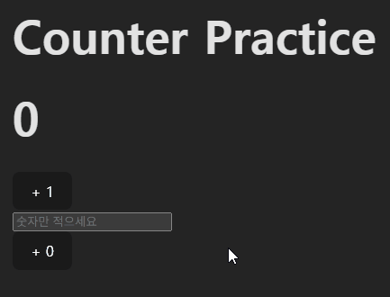

# 리액트 실습 레포

해당 레포지터리는 리액트 실습 레포 제출을 위해 생성되었습니다.

## 12/01(월) 실습

### 만두 컴포넌트

`/src/mandooComponent.jsx`

- 만두 이미지 컴포넌트에서 출력
- `props`로 `width` 값 받아서 인라인 스타일로 설정
- `App.jsx`에서 todo리스트 만두 이미지 아래에 뿌림

### 숫자 카운터 실습(`useState`)

`/src/Counter.jsx`

- 위의 버튼은 클릭시 무조건 1만 증가
- 아래 input에 적는 숫자가 아래 버튼에 동기화, 버튼 클릭시 해당 숫자만큼 증가
- input에 숫자 대신 문자 입력시 alert 띄우고 input value를 초기화
